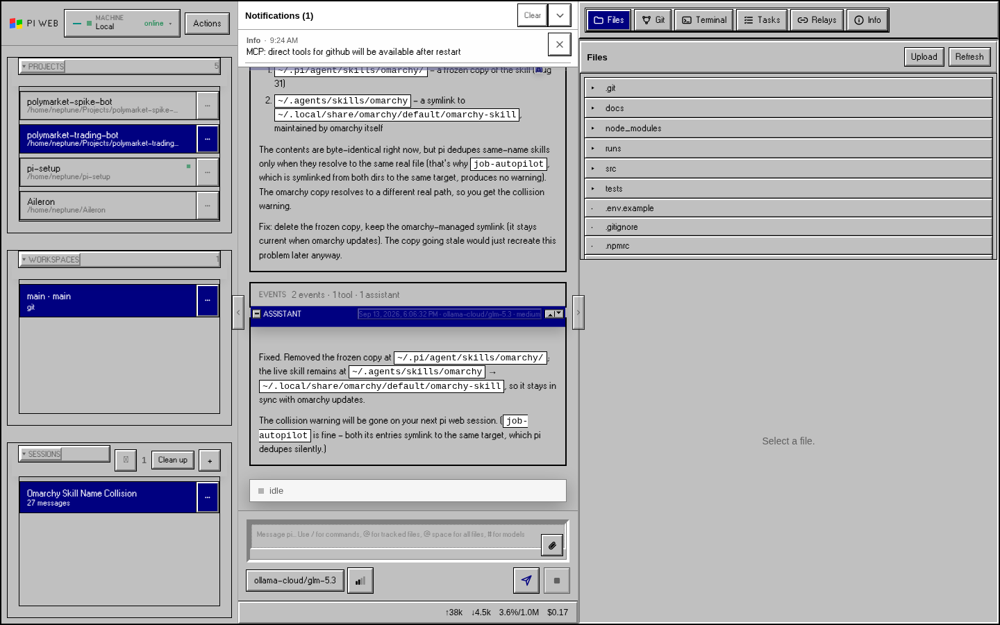
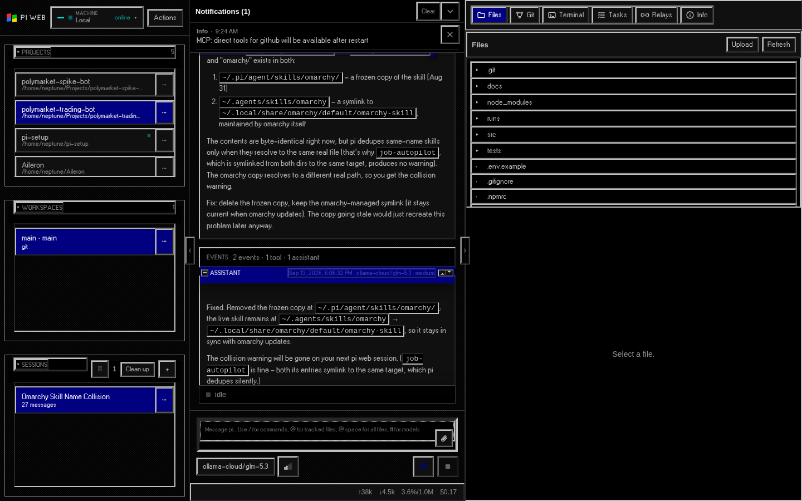

# pi-web-win31-themes

Windows 3.1 themes for [PI WEB](https://pi-web.dev): beveled chrome, navy
title bars, and the pixel font of 1992 — in two flavors.

| Theme | Scheme | Look |
| --- | --- | --- |
| **Windows 3.1 Classic** | light | The default 3.1 surface: silver `#c0c0c0` app workspace and buttons (COLOR_APPWORKSPACE / COLOR_BTNFACE) with white/gray bevels, black `#000000` window frames (COLOR_WINDOWFRAME), navy `#000080` title bars, and black text. White appears only where 3.1 used it — document and edit areas, so the prompt field and code blocks. No wallpaper or teal desktop. Terminal stays black with silver text. |
| **Windows 3.1 OLED** | dark | The same 3.1 chrome on pure `#000000`: silver text, a subtle 50% checkerboard dither, everything else you know from the Classic look. |
| **Auto pair** | follows system | Light → Classic, dark → OLED. |





## Install

As a Pi package (recommended):

```bash
pi install git:github.com/mmiller2890/pi-web-win31-themes
```

Reload your PI WEB tab, then open **Actions → Select Theme** and pick one of
the Windows 3.1 themes. Turn **Auto off** to keep your explicit choice;
with Auto on, your OS appearance selects Classic or OLED. Uninstall with
`pi remove pi-web-win31-themes`.

Or check it out directly as a local plugin:

```bash
git clone https://github.com/mmiller2890/pi-web-win31-themes \
  ~/.pi-web/plugins/win31-themes
```

Reload the tab (hard-reload after pulling changes — PI WEB pins module URLs
by content revision).

## What it does

- Contributes two PI WEB themes (full `--pi-*` token palettes) plus a
  light/dark pair, so they show up in the theme picker like any built-in.
- Injects the chrome CSS that tokens cannot express — 2px raised/sunken
  bevels, zero border radii, square chunky scrollbars, dotted focus
  outlines, and the four-pane waving flag on the corner wordmark. PI WEB
  renders inside nested open shadow roots, so the plugin keeps a themed
  `<style>` clone in every shadow root while one of its themes is active
  and removes them all on switch-away.
- Rebuilds the 3.1 window furniture from the SDK metrics: every message
  window carries the system-menu box at the left of its caption and the
  minimize/maximize arrow boxes at the right, the newest window shows the
  navy active caption while older ones take the grey inactive caption, and
  sidebar sections (Projects / Workspaces / Sessions) render as 3.1 group
  boxes with the label sitting on the frame line.
- Push buttons carry the 1px defining outline outside the bevel and shift
  their content on press; scrollbars get the stippled trough and arrow
  boxes (arrows appear in browsers that render scrollbar buttons — Safari,
  and Chromium on Windows/macOS).
- Bundles the [W95FA](https://www.dafont.com/w95fa.font) pixel font
  (SIL OFL 1.1) so controls, chat bodies, and the wordmark render like
  MS Sans Serif — offline, no CDN. Code blocks and terminals stay mono.

Everything is scoped to the active theme. Switch back to `PI WEB Dark` and
the chrome disappears without a trace.

## Compatibility

Built against PI WEB browser plugin API v2 (`apiVersion: 2`). No server
entry, no Pi extension — pure browser plugin.

## License

MIT for the code. The bundled W95FA font is SIL OFL 1.1 — see
`fonts/W95FA-OFL-LICENSE.txt`.